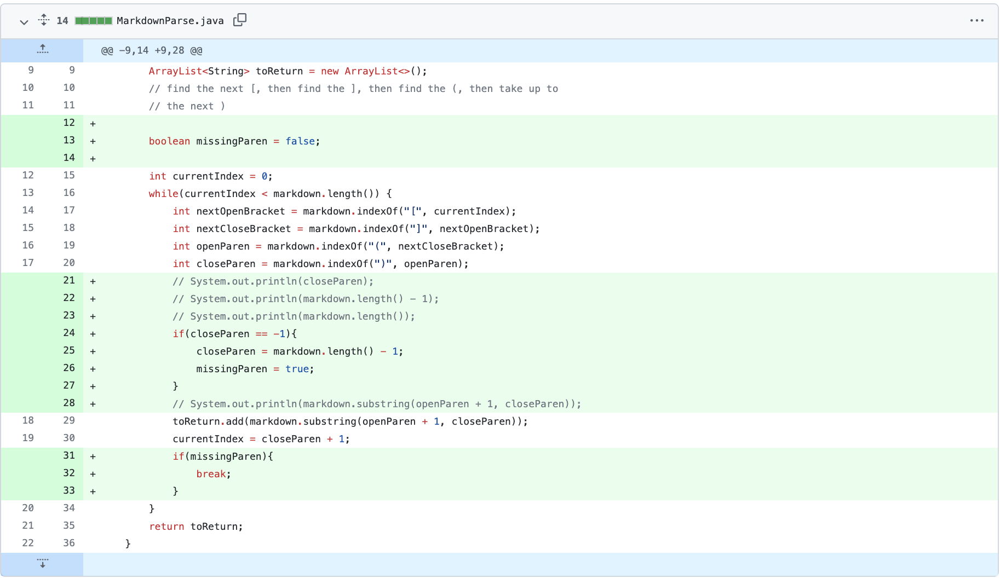
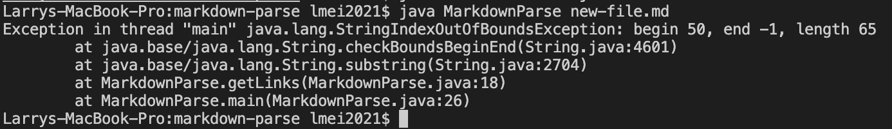
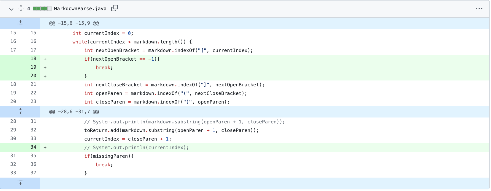
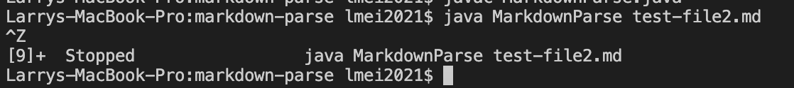
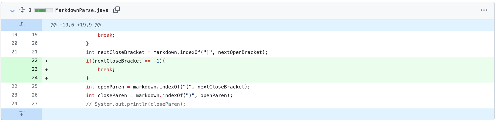
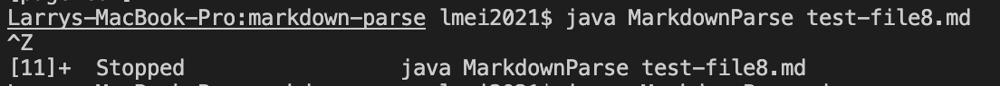

Lab Report 2
=========

## Bugs, Symptoms, and Failure-Inducing Inputs


## Change 1




[Link to test](https://github.com/lmeiucsd/markdown-parse/blob/main/new-file.md)
Test preview: 
```

[a link!](https://something.com)
[another link!](some-page.html

```

Symptom: 


Explanation: The bug is the line where the integer variable ``closeParen()`` is initialized. Since there is no closed parentheses in this markdown file, the integer is set to -1, indicating that no closed parentheses has been found, which is why there is an IndexOutOfBoundsException as the symptom. 

Solution: I fixed this by setting closeParen to the last character if closeParen = -1 and creating a boolean variable ``missingParen`` to break out of the while loop if a missing closed parentheses is detected.


## Change 2




[Link to test](https://github.com/lmeiucsd/markdown-parse/blob/main/test-file2.md)

Test preview: 
```
# Title

[a link!](https://something.com)
[another link!](some-page.html)

some paragraph text after the links

```

Symptom: 


Note: this symptom shows an infinite loop, but I had to manually stop it, otherwise the program would eat up all my computer memory

Explanation: The bug is the line where the integer variable ``nextOpenBracket`` is initialized. ``currentIndex`` gets updated to the character after the closed parentheses and ``nextOpenBracket`` attempts to find an open bracket but is unable to since after the closed parentheses there is only just text so it returns -1. This results in the symptom being an infinite loop, since using ``indexOf()`` with a ``fromIndex`` input of -1 will result in searching from the start of the markdown file again.

Solution: I implemented a if statement right after the line where the integer variable ``nextOpenBracket`` is initialized that checks if ``nextOpenBracket = -1``. If it does, that means there are no more links to search for and as a result we can safely break out of the while loop.


## Change 3




[Link to test](https://github.com/lmeiucsd/markdown-parse/blob/main/test-file8.md)

Test preview: 
```
[](a link on the first line)
[

```

Symptom: 


Note: this symptom shows an infinite loop, but I had to manually stop it, otherwise the program would eat up all my computer memory

Explanation: The bug is the line where the integer variable ``nextClosedBracket`` is initialized. ``currentIndex`` gets updated to the character after the closed parentheses and ``nextClosedBracket`` attempts to find an closed bracket but is unable to since after the closed parentheses there is only just an open bracket so ``nextClosedBracket = -1``. This results in the symptom being an infinite loop, since using ``indexOf()`` with a ``fromIndex`` input of -1 will result in searching from the start of the markdown file again.

Solution: I implemented a if statement right after the line where the integer variable ``nextClosedBracket`` is initialized that checks if ``nextClosedBracket = -1``. If it does, that means there are no more links to search for and as a result we can safely break out of the while loop.


