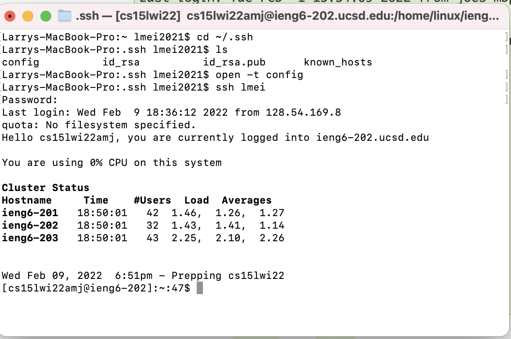

Lab Report 3
=========

## Streamlining ssh Configuration


The first step is to open ``~/.ssh/config`` on my computer. I did this by using the Terminal app on my MacOS computer. 

Once I opened Terminal, I typed ``cd ssh`` to change the directory to the ssh folder. I then typed ``ls`` to see if the ``config`` file existed on my computer, and it did exist. I then typed ``open -t config`` to open the ``config`` file to edit it.

I used this [StackOverflow post](https://stackoverflow.com/questions/54133300/how-to-access-and-modify-a-ssh-file-on-mac) to help me access and modify a SSH file on Mac.

I then put the following lines in ``config``:

```
Host lmei
    HostName ieng6.ucsd.edu
    User cs15lwi22zzz

```

The line ``Host lmei`` acts as a custom alias for ``ssh`` to interpret, so I changed ``ieng6`` to an abbreviation of my name ``lmei``.



After I saved the ``config`` file, I typed in ``ssh lmei`` and after I typed in my password, I was able to log in to my remote ssh server.

I then tested if we could use ``scp`` to copy a file to the remote account using my custom alias. 


For this task, I went on VSCode and used my ``/markdown-parse`` directory to copy ``MarkdownParse.java`` to the remote server.

I was able to do this by typing the command ``scp MarkdownParse.java lmei:~/``. I then typed my password to confirm this action. In the image above, I also logged in to my remote server and used ``ls`` to check if ``MarkdownParse.java`` was successfully copied, and it was.