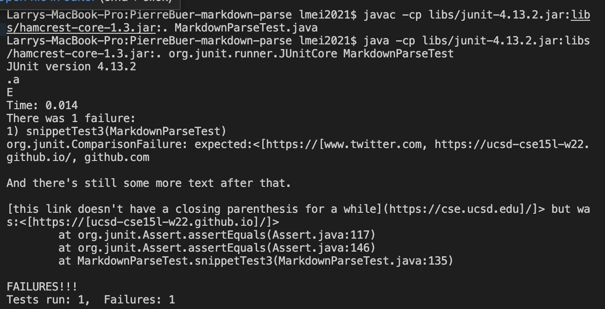

Lab Report 4
=========

[My markdown-parse repo](https://github.com/lmeiucsd/markdown-parse)

[The markdown-parse repo our lab group reviewed](https://github.com/PierreBeur/markdown-parse)


## Snippet 1

I put the contents of Snippet 1 into [CommonMark](https://spec.commonmark.org/dingus/) and decided that the expected result should be ``[`google.com, google.com, ucsd.edu]``. My reasoning is that I only include links that highlight as blue.


I implemented Snippet 1's test method as shown in the image below:


I then used this test on my implementation of ``MarkdownParse.java`` and the implementation we reviewed on Week 7:


The first image is testing my implementation and the second image is testing the implementation we reviewed on Week 7. In both tests, the expected value omits ``url.com`` because the backticks make it display only the closed bracket on the webpage.


However, both implementations include ``url.com``. I think there is a small code change that would make my program work for Snippet 1 and all related inlide code with backticks. I would search for every instance of backticks in the markdown file and save its indices, and for every pair of backticks I would make it so that ``MarkdownParse.java`` ignores whatever indices are between the pair of backticks. If there is just a single backtick left then nothing will happen.


## Snippet 2

I put the contents of Snippet 1 into [CommonMark](https://spec.commonmark.org/dingus/) and decided that the expected result should be ``[a.com, a.com(()), example.com]``. My reasoning is that I only include links that highlight as blue.


I implemented Snippet 2's test method as shown in the image below:


I then used this test on my implementation of ``MarkdownParse.java`` and the implementation we reviewed on Week 7:


The first image is testing my implementation and the second image is testing the implementation we reviewed on Week 7. In both tests, the expected value omits the pair of closed parentheses ``))``.

I think the code change for making my program work for snippet 2 and all other related cases of nested parentheses, brackets, and escaped brackets would be a small change. It seems that my program works for nested brackets and espcaed brackets correctly but does not implement cases with nested parentheses correctly. I would need to detect when there is a pair of nested parentheses and if there is such a pair, make sure to add both the open and closed parentheses to the ArrayList.

## Snippet 3

I put the contents of Snippet 1 into [CommonMark](https://spec.commonmark.org/dingus/) and decided that the expected result should be ``[https://ucsd-cse15l-w22.github.io/]``. My reasoning is that I only include links that highlight as blue.


I implemented Snippet 3's test method as shown in the image below:


I then used this test on my implementation of ``MarkdownParse.java`` and the implementation we reviewed on Week 7:




The first image is testing my implementation and the second image is testing the implementation we reviewed on Week 7. In my implementation and the implementation we reviewed, the contents are the same but they are spaced out quite differently. Nonetheless, it included a lot of text that was not part of the expected result.

I think the code change for making my program work for snippet 3 and all other related cases of having newlines in brackets and parentheses would be a more involved change. Basically, I need to make sure that I count valid links with only one newline and omit links with more than one newline. I have to apply that logic to brackets and parentheses and I also have to omit invalid links with newlines as well, which is basically these lines in the markdown file: 
```
[this link doesn't have a closing parenthesis](github.com

And there's still some more text after that.

[this link doesn't have a closing parenthesis for a while](https://cse.ucsd.edu/


)

And then there's more text
```