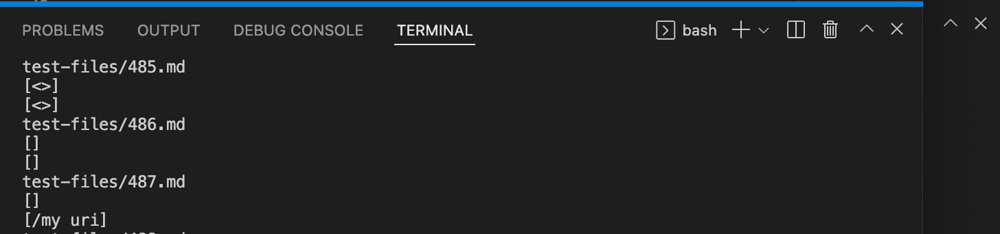

Lab Report 5
=========

# How I found tests with different results

I first added my personal implementation of ``MarkdownParse.java`` in the week 9 version of Joe's ``markdown-parse`` directory. I named this file ``MyMarkdownParse.java``.
I changed the file ``script.sh`` so that it would print the name of the file, then print the results of ``MarkdownParse.java`` and``MyMarkdownParse.java`` in that order. Below is my implementation of ``script.sh``:


I then ran ``javac MyMarkdownParse.java`` and ``make`` in the terminal, then ran ``bash script.sh`` to view the differences.

## Test 1

The first test with different answers that I choose is from ``test-files/12.md``. The content in ``12.md`` is as follows:

```

\!\"\#\$\%\&\'\(\)\*\+\,\-\.\/\:\;\<\=\>\?\@\[\\\]\^\_\`\{\|\}\~

```

Here is the differing results from my terminal output:


I think the output from Joe's ``MarkdownParse.java`` file is correct because there is no pair of brackets concatenated with a pair of parentheses, so the output should be empty.

The problem in my implementation is that it only checks if there is no parentheses or brackets, shown in this code snippet:


But this is not enough, since I did not consider the edge case of the markdown string not having a string ``](`` so I would need to also check if there exists a string ``](``, if not then I can break out of the while loop.

# Test 2

The second test with different answers that I choose is from ``test-files/487.md``. The content in ``487.md`` is as follows:

```

[link](/my uri)

```

Here is the differing results from my terminal output:



I think the output from Joe's ``MarkdownParse.java`` file is correct because there since there is a space in the contents between the parentheses, this markdown is not a valid link anymore, so the output should be empty.

The problem in my implementation is that it does not check for a space between the indices of the parentheses. It simply adds the contents between the parentheses without checking at all, as shown in this image below:


A potential fix to this is that before adding the contents between the parentheses, I need to check if there is a space using ``indexOf(openParen + 1, closedParen)``. If there is a space, I do not add to the ArrayList, and if there isn't I proceed and add the contents to the ArrayList.